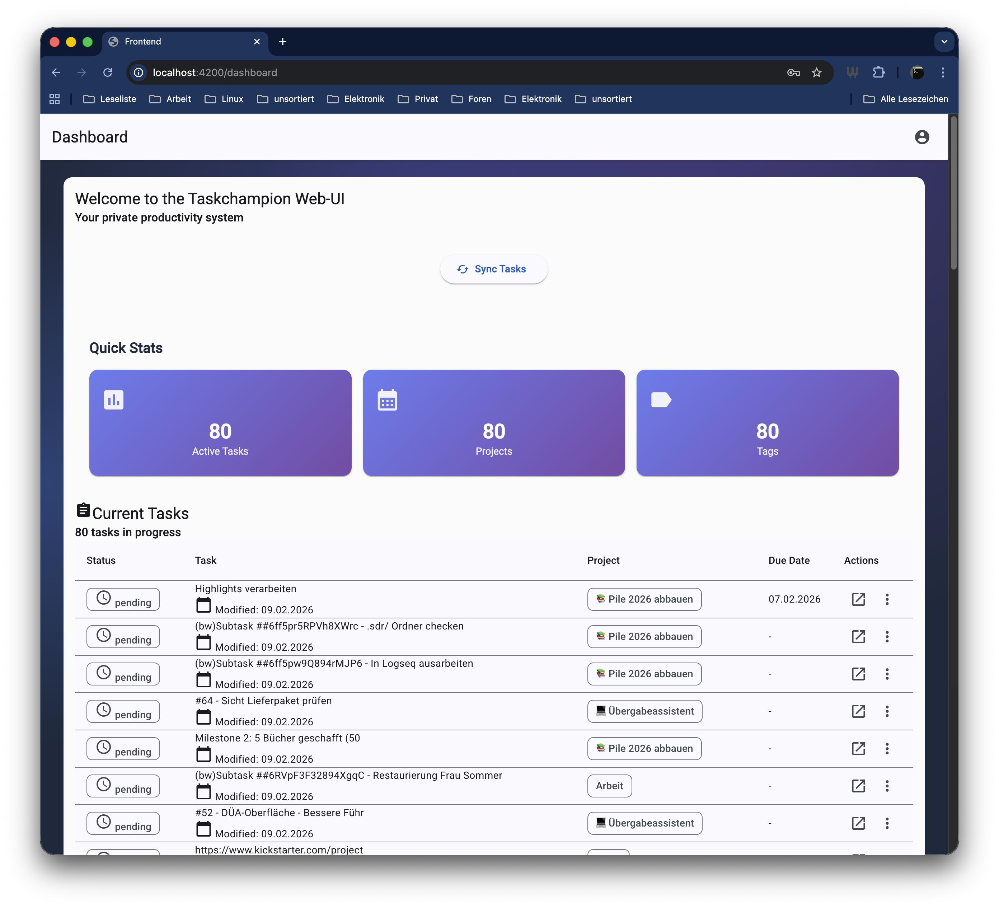

# Taskchampion-Web

A modern web-based task management system for [Taskwarrior](https://taskwarrior.org/) and [Taskchampion](https://github.com/GothenburgBitFactory/taskchampion). This project provides a full-stack environment to manage your tasks with a clean web interface, a robust Go backend, and a specialized Rust middleware for Taskchampion synchronization.




## Architecture

The project is composed of several specialized services:

- **Frontend**: An Angular-based web application providing a user-friendly task management interface.
- **Backend**: A Go-based API server that handles business logic, user management, and communicates with the middleware.
- **Middleware**: A Rust-based service that interacts directly with Taskchampion, providing RESTful access and handling end-to-end encryption and synchronization.
- **Sync Server**: A Taskchampion synchronization server for backing up and syncing tasks across multiple clients.
- **Database**: PostgreSQL/SQLite is used for persistent storage.

## Project Structure

```text
.
├── backend/       # Go (Gin) API Server
├── frontend/      # Angular Web Application
├── middleware/    # Rust Taskchampion Middleware
└── docs/          # Project documentation
```

## Getting Started

### Prerequisites

- [Docker](https://www.docker.com/) and [Docker Compose](https://docs.docker.com/compose/) (or Podman/podman-compose)
- An `.env` file based on `env-sample`

### Quick Start

1. **Clone the repository**:
   ```bash
   git clone <repository-url>
   cd taskchampion-web
   ```

2. **Configure environment**:
   ```bash
   cp env-sample .env
   # Edit .env with your configuration
   ```

3. **Start the services**:
   ```bash
   docker-compose up -d
   ```
   Or using the Makefile in the backend directory:
   ```bash
   cd backend && make docker-up
   ```

4. **Access the application**:
   - Frontend: `http://localhost:4200`
   - Backend API: `http://localhost:8090`
   - Middleware API: `http://localhost:3001`

## Development

Each component has its own detailed README with development instructions:

- [Backend Documentation](./backend/README.md)
- [Frontend Documentation](./frontend/README.md)
- [Middleware Documentation](./middleware/README.md)

### DevContainer Setup (Frontend)

The frontend includes a pre-configured [DevContainer](https://containers.dev/) setup for VS Code. This allows you to start developing immediately without installing Node.js or the Angular CLI on your local machine.

#### Using with Docker
1. Ensure you have the **Dev Containers** extension installed in VS Code.
2. Open the project root in VS Code.
3. When prompted, click **Reopen in Container** (or use the Command Palette: `Ctrl+Shift+P` -> `Dev Containers: Reopen in Container`).

#### Using with Podman
If you prefer [Podman](https://podman.io/), follow these steps:
1. Install the **Dev Containers** extension.
2. In VS Code Settings (`Ctrl+,`), search for `dev.containers.dockerPath` and set it to `podman`.
3. If you are on Linux with SELinux enabled, you might need to add the following to your `frontend/.devcontainer/devcontainer.json` if you encounter permission issues:
   ```json
   "runArgs": ["--security-opt", "label=disable"]
   ```
4. Open the project and select **Reopen in Container**.

## License

See the LICENSE files in individual component directories.
